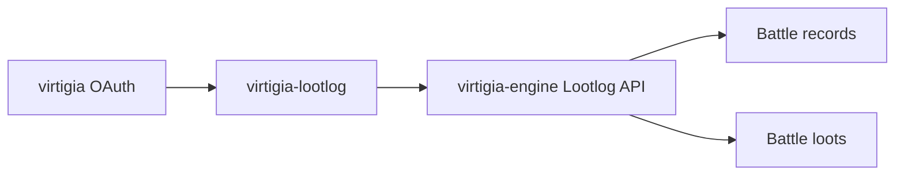

# Virtigia Lootlog

Panel do przeglądania historii walk i łupów z silnika Virtigii. Aplikacja łączy się z `virtigia-engine` przez Lootlog API, loguje użytkownika przez OAuth i prezentuje dane o battle records, battle loots oraz aktywności w konkretnych dniach.

## Rola Aplikacji

Lootlog jest narzędziem analitycznym. Nie zmienia świata gry, tylko pomaga zobaczyć, co wypadło, kiedy, komu i z jakiej walki.



## Co Oferuje

| Widok | Zastosowanie |
| --- | --- |
| Home | startowy widok panelu |
| Battle Dates | agregacja walk po dniach |
| Battle Loots | lista łupów z walk |
| Login | logowanie przez OAuth |
| Callback | obsługa powrotu po OAuth |

## Najważniejsze Funkcje

- Logowanie przez OAuth z portalu Virtigii.
- Pobieranie profilu użytkownika.
- Podgląd dat walk.
- Podgląd łupów z walk.
- Tabele z paginacją i filtrowaniem.
- Tooltipy przedmiotów przez `virtigia-tips`.
- Typowany klient API generowany ze Swaggera engine.
- PWA przez Vite.

## API

Aplikacja korzysta z endpointów silnika pod prefiksem `/lootlog/api`:

| Endpoint | Zastosowanie |
| --- | --- |
| `POST /lootlog/api/auth/oauth/callback` | logowanie OAuth |
| `GET /lootlog/api/profile/me` | profil zalogowanego użytkownika |
| `GET /lootlog/api/battle-records` | historia walk |
| `GET /lootlog/api/battle-loots` | łupy z walk |
| `GET /lootlog/api/battle-dates` | daty walk |

## Technologie

- Vue 3.
- Vite.
- Vue Router.
- Pinia.
- Tailwind CSS.
- Chart.js.
- Axios.
- Swagger TypeScript API.
- OpenAPI TypeScript.
- `virtigia-tips`.

## Uruchomienie Lokalne

```bash
npm install
npm run dev
```

Build:

```bash
npm run build
```

Preview:

```bash
npm run preview
```

Formatowanie:

```bash
npm run format
```

Lint:

```bash
npm run lint
```

Generowanie typów i klienta API:

```bash
npm run docs
npm run api
```

## Powiązane Repozytoria

| Repozytorium | Rola |
| --- | --- |
| `virtigia-engine` | źródło danych o walkach i łupach |
| `virtigia` | OAuth i konta użytkowników |
| `virtigia-game-client` | miejsce, w którym walki i looty powstają w rozgrywce |
| `virtigia-tips` | tooltipy przedmiotów |
